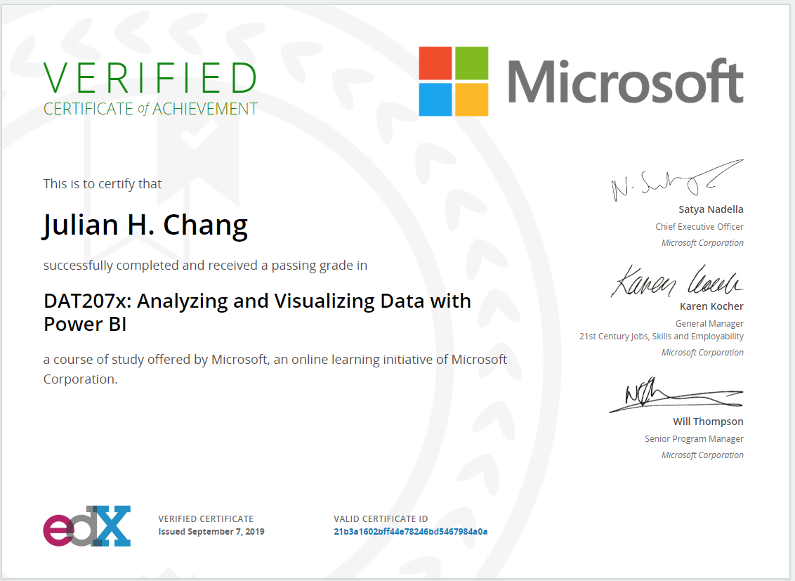
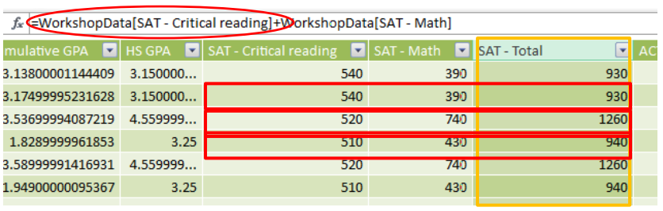
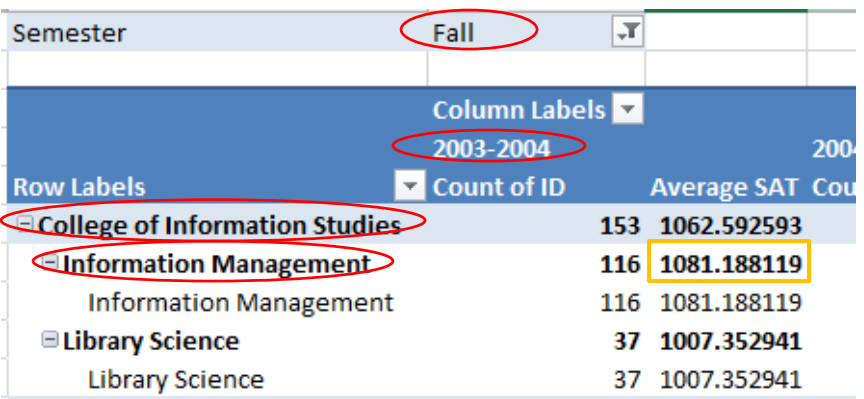

# power-bi-dax-reference
Data Analysis Expressions (DAX) is a library of functions and operators that can be combined to build formulas and expressions in Power BI Desktop, Azure Analysis Services, SQL Server Analysis Services, and Power Pivot in Excel.
\

\
## Link: [EDX VERIFIED CERTIFICATE of ACHIEVEMENT](courses.edx.org/certificates/21b3a1602bff44e78246bd5467984a0a)

---
# Data Analysis Expressions
### DAX is a formula language. DAX formulas can be used to define calculated columns in a table and they can also be used to define measures (also known as calculated fields).

Calculated columns are just like in Excel – you enter a formula, and that formula is evaluated for each row in the table, effectively filling in the entire column with values.  

A measure is different. When you define a measure, you provide a DAX formula and a name. This measure can be placed onto an Excel PivotTable, and it will be evaluated many times, once for each cell in the values area of that PivotTable.

## Calculated Columns
– Used to add an additional column to data table  
– Can be a column added from a related table (like a
VLOOKUP) or new data, derived from existing data  
– Column can be used in any area of the pivot

## Calculated Fields  
– Used to add a calculated element  
– Aggregate function that applies to whole table, column, or range  
– Something that needs to be recalculated
– Fields can only be used in the VALUES section

## Row context
• The one row being evaluated  
• Automatic for calculated columns  
• Can be created in other ways as well (SUMX, AVERAGEX, etc.)

## Filter context  
• The filters being applied by the pivot table  
• Filters can be explicit or implicit  
• Can add additional filters only with CALCULATE

## Filter Context
Filter context is added when you specify filter constraints on the set of values allowed in a column or table, by using arguments to a formula. Filter context applies on top of other contexts, such as row context or query context.

For example, a PivotTable calculates its values for each cell based on the row and column headings, as described in the preceding section on query context. However, within the measures or calculated columns that you add to the PivotTable, you can specify filter expressions to control the values that are used by the formula. You can also selectively clear the filters on particular columns.

For more information about how to create filters within formulas, see the [FILTER Function](https://docs.microsoft.com/en-us/previous-versions/sql/sql-server-2012/ee634966%28v%3dsql.110%29).

For an example of how filters can be cleared to create grand totals, see the [ALL Function](https://docs.microsoft.com/en-us/previous-versions/sql/sql-server-2012/ee634802%28v%3dsql.110%29).

For examples of how to selectively clear and apply filters within formulas, see the [ALLEXCEPT Function](https://docs.microsoft.com/en-us/previous-versions/sql/sql-server-2012/ee634795%28v%3dsql.110%29).

Therefore, you must review the definition of measures or formulas used in a PivotTable so that you are aware of filter context when interpreting the results of formulas.

Allington, Matt. Learn to Write DAX: A practical guide to learning Power Pivot for Excel and Power BI (Kindle Locations 219-228). Holy Macro! Books. Kindle Edition. 

## Resources
DAX Studio [link](https://daxstudio.org)  
DAX Formatter [link](https://www.daxformatter.com/)